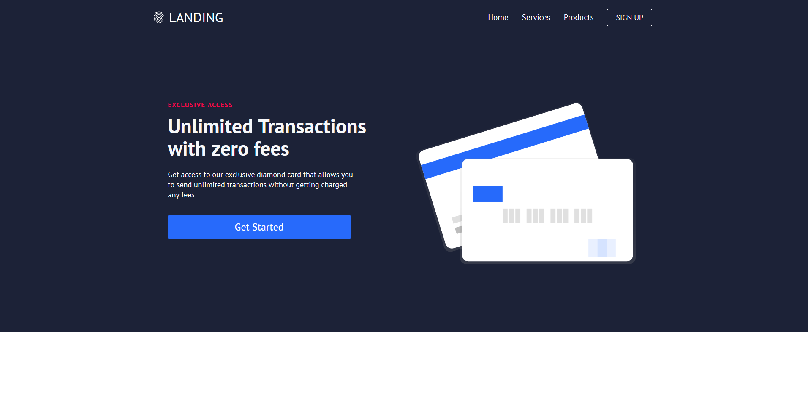

# Landing⠀⠀⠀⠀⠀⠀⠀⠀  ⠀⠀⠀⠀⠀⠀⠀⠀⠀⠀⠀⠀⠀⠀⠀⠀  ⠀⠀⠀⠀⠀⠀⠀⠀⠀⠀⠀⠀⠀⠀⠀⠀[![Button Icon]](https://joaomartinscode.github.io/todo_app/)
<!----------------------------------------------------------------------------->
[Button Icon]: https://img.shields.io/badge/-Live%20view-blueviolet



## Technologies
Project is created with:
* Vite
* React.js
* Javascript
* Sass
* Html
	
## Setup
To run this project, install it locally using npm:

```
$ cd developer-quiz
$ npm install
$ npm run dev
```
